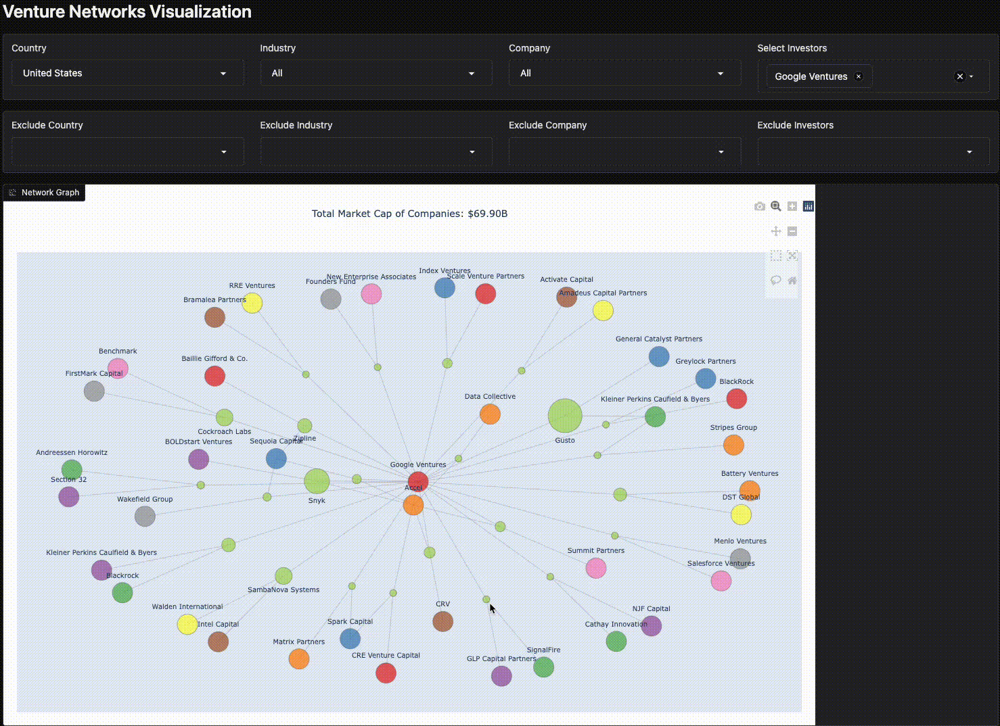

# [venture-unicorns](https://leoncensh-networkx-saas.hf.space/)

## Network analysis of venture-backed unicorns using CB Insights data

## Data as of 09/21/2024



# How to run this app on your own machine! 

**If you found the app useful, please make sure to give us a star!**

### Clone this Repository

```bash
git clone https://github.com/LNshuti/saas-winners.git


```

### Setup your Environment
```bash
conda env create --file=environment.yaml
```

### Activate your Environment
```bash
conda activate saas-winers
```

### Install Dependencies
```bash 
pip install -r requirements.txt
```

### Run the **app.py** 
```bash
python app.py
```
